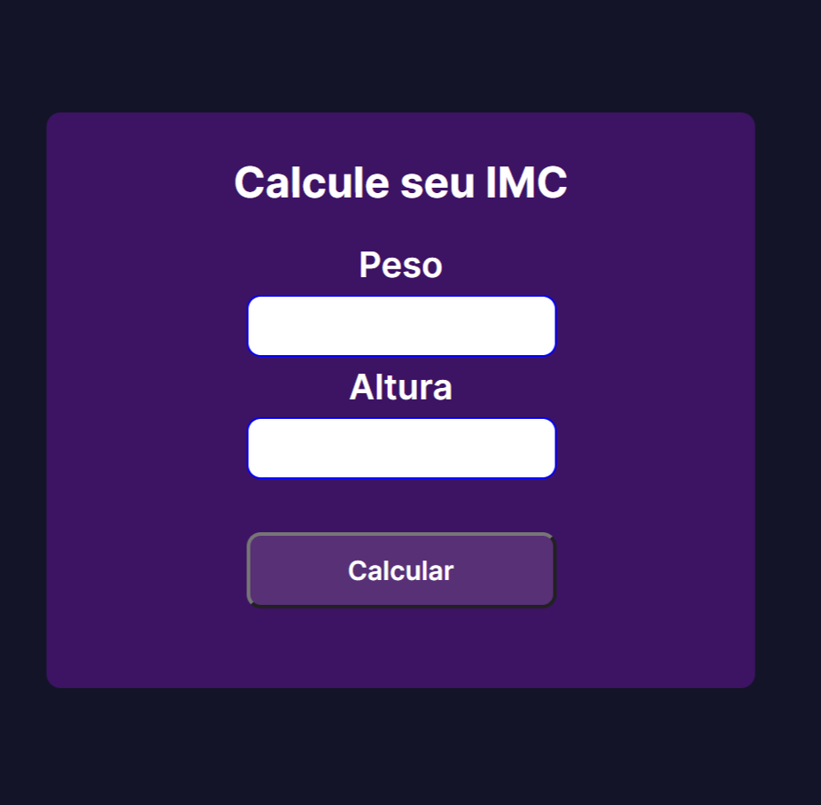

<h1 align="center"> basic Imc project </h>

<h2> Imc e um projeto com intuito de calcular o indice de massa corporal.  </h2> 

<h2>
   <a href="#-tecnologia">Tecnologias</a>&nbsp;&nbsp;&nbsp;|&nbsp;&nbsp;&nbsp;
   <a href="#-tecnologia">Projetos</a>&nbsp;&nbsp;&nbsp;|&nbsp;&nbsp;&nbsp;
   <a href="#memo-tecnologia">licença</a>
</h2>

 

  

## 🤖 Tecnologias

<h3>Esse projeto foi desenvolvido com as seguintes tecnologias</h3>
 

- HTML
- CSS
- JavaScript
- Git/Github

## 🖥️ Projeto

Projeto Imc e um app que calcula seu indice de massa corporal.

- [📌Acesse o projeto finalizado, online](https://jeferson-3.github.io/Projeto_IMC/)

 
 

## :memo: Licença
Essa licença esta sob a licença MIT